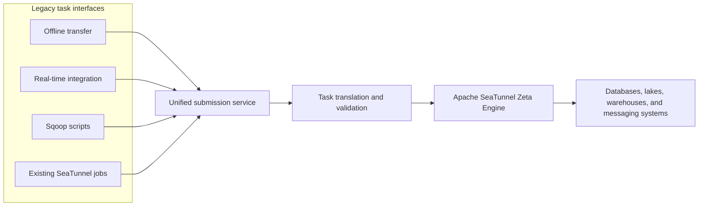
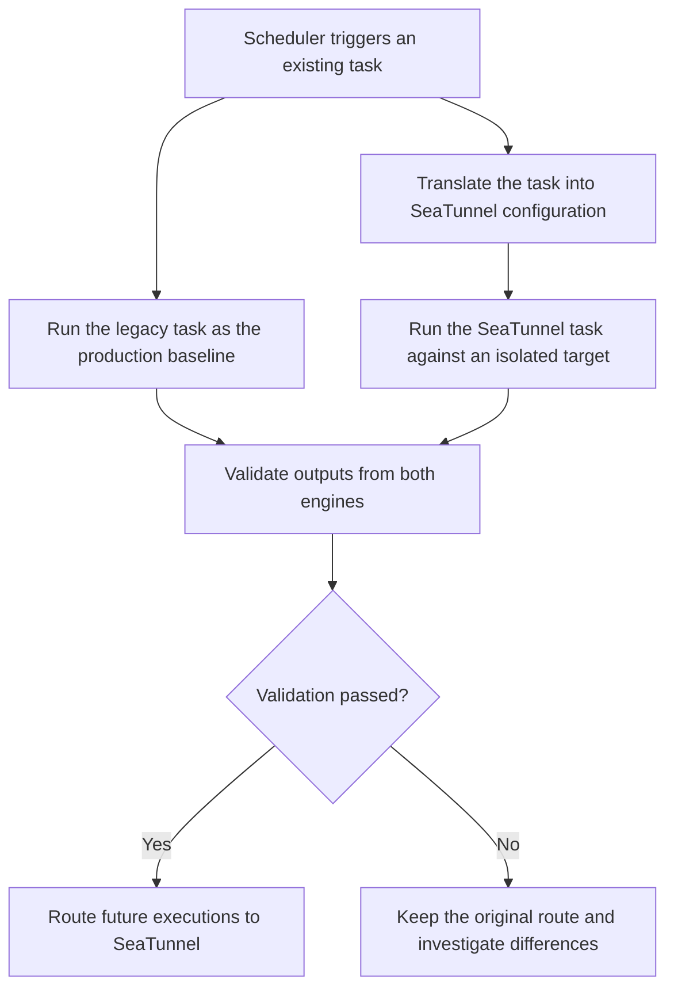

Tongcheng Travel's data channel evolved over several years into four parallel systems for offline transfer, real-time integration, Sqoop jobs, and SeaTunnel jobs. Each system solved a problem at a particular stage, but their overlapping capabilities, different execution engines, and separate operational models eventually became a barrier to platform-wide governance.

At an Apache SeaTunnel Meetup, Xiaochen Zhou, who works on the data platform at Tongcheng Travel, explained how the company consolidated those systems into a unified batch and streaming data channel based on the Apache SeaTunnel Zeta Engine. The project had three non-negotiable goals: keep the migration transparent to application teams, prove data consistency before switching traffic, and improve execution efficiency and operational stability.

This article summarizes the architecture, migration safeguards, AI-assisted task generation, validation design, and future direction presented in that session.

<!-- truncate -->

## Why four data channels had to become one

Before the consolidation, Tongcheng Travel operated four data transfer paths:

- An offline data transfer service based on Flink 1.6
- A real-time data integration service based on Flink
- Legacy Sqoop jobs running on MapReduce
- SeaTunnel Zeta jobs already used by part of the business

The systems covered similar source and sink combinations, but they differed in task syntax, runtime behavior, resource models, and operational tooling. Legacy MapReduce jobs were comparatively heavy, the old Flink runtime was difficult to maintain, and large database extraction workloads could also put pressure on online databases.

The target architecture was therefore not another independent service. It was one platform entry point and one execution foundation for batch and streaming data movement.

*Simplified flow based on the public Meetup presentation.*

Tongcheng Travel established three principles for the migration:

1. **No application-side rewrite.** Existing teams should continue submitting their familiar scripts while the platform translates them underneath.
2. **Consistency before cutover.** New and old engines must run in parallel until their outputs pass validation.
3. **Better efficiency and stability.** The new foundation should reduce the burden of maintaining several runtimes while taking advantage of Zeta's data-integration-oriented execution model.

## Translating existing tasks without changing user behavior

The largest migration challenge was not writing a new SeaTunnel job. It was moving tens of thousands of existing Sqoop and Flink SQL tasks without requiring every application team to rewrite its jobs.

Tongcheng Travel introduced a skill layer that recognizes the syntax and configuration of each legacy task type. A Sqoop skill, a Flink SQL skill, and a SeaTunnel skill map the original task into a standard SeaTunnel configuration. A unified submission service then validates and submits that generated configuration.

Migration uses a dual-run process:

*Simplified migration flow based on the public Meetup presentation.*

The legacy task remains the production baseline during migration, while the translated SeaTunnel task writes to an isolated location. Only after validation succeeds does the platform change the execution route. This keeps the migration invisible to application developers and provides a rollback boundary for every task.

## Building new tasks from natural language

The platform also explores a different entry point for new workloads: describing a data movement requirement in natural language.

A request such as "synchronize yesterday's core product sales data to the warehouse" is incomplete by itself. The system first combines the request with metadata and historical behavior to identify the likely source table, target system, partitions, and execution parameters. The SeaTunnel skill then assembles the corresponding source, transform, and sink configuration.

For SQL generation, Tongcheng Travel uses multiple candidate-generation strategies rather than trusting one model response:

- A reasoning generator creates SQL directly from the intent and schema.
- In-context learning retrieves successful historical SQL as examples.
- A divide-and-conquer generator decomposes complex SQL into smaller common table expressions.
- A selector evaluates syntax, abstract syntax tree complexity, and estimated execution cost before choosing the final SQL.

For transformation tasks, common requirements are routed to native SeaTunnel transforms such as Filter, Replace, and Split. When a requirement cannot be expressed by a normal transform combination, the platform can generate code or a script and load the compiled result as a task plugin. An interactive data preview remains part of the workflow so that users can confirm the result before execution.

This design treats the model as a task authoring assistant, while metadata, validation, preview, and the SeaTunnel runtime provide the engineering guardrails.

## Proving data consistency during migration

Running both engines is useful only when their outputs can be compared reliably. Tongcheng Travel uses different validation strategies for file outputs and table outputs.

### File output validation

Loading every record from large files into memory would be slow and could cause out-of-memory failures. Instead, the validation process normalizes each row, calculates a hash, and builds an external index containing the hash, file identifier, and line number.

The comparison has two levels:

1. Bloom filters quickly identify records that are definitely absent from the other output.
2. Externally sorted indexes are compared with two pointers. When equal hashes are found, their occurrence counts are also compared so duplicate rows are not hidden.

If a difference is detected, the file identifier and line number provide a direct path back to the original record. This avoids an expensive in-memory full comparison while preserving the ability to diagnose a mismatch.

### Table output validation

For relational databases and warehouses, the platform uses the target system's SQL engine to calculate per-column characteristics. One example presented in the session applies `murmur_hash3_32` after normalizing null values, then aggregates those hashes for comparison.

This method is intended to detect migration differences efficiently.

> **Editorial note:** For critical data, hash comparison should remain one layer of a broader validation strategy that also includes row counts, null distributions, key business aggregates, and targeted record checks.

## Improving connectors, parallelism, and observability

After the execution path was unified, Tongcheng Travel continued improving the runtime around three areas.

### Connector reliability

The work described in the session covered Paimon type support and predicate pushdown, high availability for StarRocks and Doris frontends, Kafka and RocketMQ stream stability, HBase range reads, and HDFS ViewFs compatibility. These improvements reflect a practical lesson from platform consolidation: the unified engine must handle the long tail of production source and sink behavior, not only the common happy path.

### Adaptive parallelism

Before task submission, the platform probes source characteristics such as row count, directory size, Kafka partition count, or Paimon bucket count. It combines those characteristics with available cluster resources and sink-side rate limits to estimate task parallelism. The goal is to align execution concurrency with both the physical data layout and the capacity of the destination system.

### Operational visibility

The platform extends checkpoint monitoring with end-to-end duration, state size, and failure frequency. It also monitors master election duration, failover frequency, and active-master health. These metrics make it easier to distinguish a task-level bottleneck from an engine or cluster-control-plane problem.

## What the architecture demonstrates

Tongcheng Travel's experience is not simply a migration from one tool to another. Its main value lies in how the migration was controlled:

- Preserve existing user interfaces while replacing the runtime underneath.
- Translate tasks centrally instead of distributing migration work across application teams.
- Run old and new engines together before switching production traffic.
- Make output validation a cutover gate rather than a post-migration check.
- Use AI to reduce task authoring effort, but keep metadata, preview, selection, and validation in the control loop.
- Treat connector coverage, adaptive execution, and observability as platform capabilities.

The next stage presented by Tongcheng Travel focuses on Kubernetes-native elastic workers, centralized remote job logs, natural-language task generation, automated root-cause analysis, and automatic parallelism tuning. Together, these capabilities move the data channel from manually operated pipelines toward an increasingly self-managing integration platform.

## Speaker and original material

Xiaochen Zhou works on the data platform at Tongcheng Travel and presented this architecture at an Apache SeaTunnel Meetup. This independently written technical summary reports the publicly presented facts in a new structure; it does not reproduce the source article's images or extended passages.

- [Original Chinese Meetup recap](https://www.cnblogs.com/seatunnel/p/21524896)
- [Full Meetup replay](https://weixin.qq.com/sph/AkwdgrLP62)
- [Xiaochen Zhou on GitHub](https://github.com/xiaochen-zhou)
