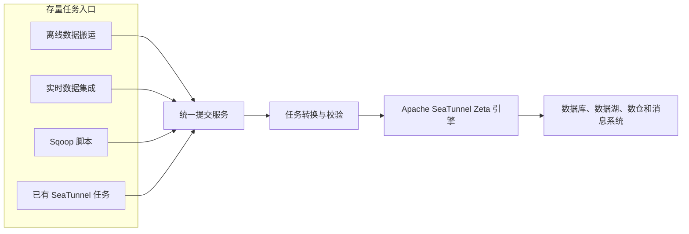
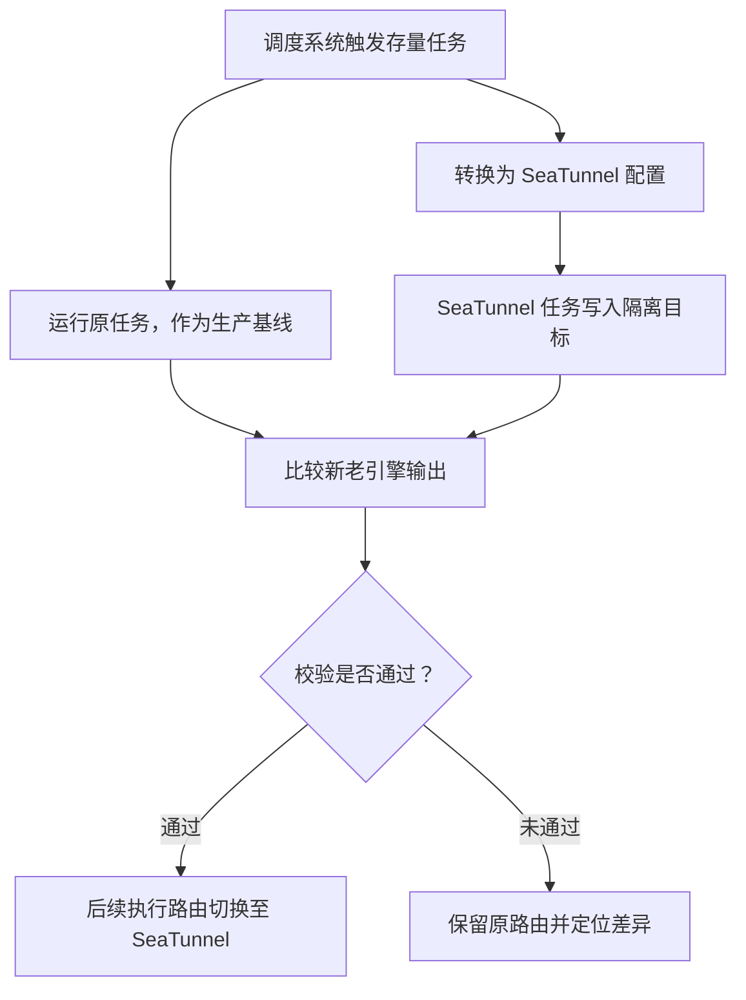

同程旅行的数据通道经过多年演进，逐步形成了离线搬运、实时集成、Sqoop 和 SeaTunnel 四套系统并存的格局。每套系统都解决了特定阶段的问题，但功能重叠、执行引擎割裂、运维体系分散，也逐渐成为平台统一治理的障碍。

在 Apache SeaTunnel Meetup 上，负责同程旅行数据平台相关工作的周晓晨，分享了同程旅行以 Apache SeaTunnel Zeta 引擎为统一底座，将四套系统收敛为批流一体数据通道的实践。整个项目有三个不可妥协的目标：迁移过程对业务透明、切换前证明数据一致、同时提升执行效率和运行稳定性。

本文以该场公开分享的事实为依据，独立梳理其统一架构、迁移保障、AI 辅助任务生成、数据校验设计以及后续规划。

<!-- truncate -->

## 为什么要把四套通道统一为一套

整合之前，同程旅行运行着四类数据传输链路：

- 基于 Flink 1.6 的离线数据搬运服务；
- 基于 Flink 的实时数据集成服务；
- 运行在 MapReduce 上的存量 Sqoop 任务；
- 已经在部分业务中使用的 SeaTunnel Zeta 任务。

这些系统覆盖了相似的数据源和目标端，但任务语法、运行方式、资源模型和运维工具各不相同。存量 MapReduce 任务相对笨重，老版本 Flink 的维护成本较高，大规模数据库抽取任务还可能给在线数据库带来压力。

因此，目标架构不是再建设第五套服务，而是形成统一的平台入口和批流一体执行底座。

*根据公开 Meetup 分享整理的简化流程。*

同程旅行为迁移设定了三项原则：

1. **业务侧零改造。** 业务团队继续使用熟悉的脚本和提交方式，由平台在底层完成转换。
2. **验证通过后再切换。** 新老引擎必须并行运行，输出校验通过后才能切换执行路由。
3. **效率和稳定性共同提升。** 在减少多套运行时维护负担的同时，发挥 Zeta 面向数据集成场景的执行优势。

## 在不改变用户习惯的情况下转换存量任务

迁移最大的难点并不是新写一个 SeaTunnel 任务，而是在不要求业务逐一改造的前提下，迁移数万个存量 Sqoop 和 Flink SQL 任务。

同程旅行引入了一层 Skill 能力组件，用于识别不同存量任务的语法和配置。Sqoop Skill、Flink SQL Skill 和 SeaTunnel Skill 分别负责将原任务映射为标准的 SeaTunnel 配置，再由统一提交服务完成校验和提交。

迁移采用双跑机制：

*根据公开 Meetup 分享整理的简化迁移流程。*

迁移期间，原任务继续承担生产基线，转换后的 SeaTunnel 任务写入隔离目录或测试目标。只有校验通过，平台才会把后续执行路由切换到 SeaTunnel。这既让业务开发人员无须感知底层变化，也为每个任务保留了清晰的回退边界。

## 用自然语言生成新的数据通道任务

对于新增任务，平台还探索了另一种入口：通过自然语言描述数据搬运需求。

“把昨天核心商品的销售数据同步到数仓”这样的请求本身并不完整。系统首先结合元数据和历史行为识别可能的源表、目标系统、分区和执行参数，再由 SeaTunnel Skill 组装相应的 Source、Transform 和 Sink 配置。

在 SQL 生成环节，同程旅行没有直接信任单次模型输出，而是并行生成多个候选方案：

- 推理生成器根据意图和 Schema 直接生成 SQL；
- ICL 生成器检索历史上成功执行的高质量 SQL 作为示例；
- 分治生成器把复杂 SQL 拆分成较小的 CTE 子查询；
- 最终选择器根据语法、抽象语法树复杂度和预估执行代价选出结果。

对于数据转换需求，常规场景会路由到 Filter、Replace、Split 等 SeaTunnel 原生 Transform；当普通 Transform 组合无法表达复杂清洗逻辑时，平台可以生成代码或脚本，编译后作为任务插件加载。流程中仍保留交互式数据预览，让用户在正式执行前确认结果。

在这套设计里，大模型承担任务编写助手的角色，元数据、候选选择、数据预览、结果校验和 SeaTunnel 执行引擎共同构成工程护栏。

## 如何证明迁移前后的数据一致

只有能够可靠比较输出，双跑才真正有价值。同程旅行针对文件输出和数据表输出设计了不同的校验方法。

### 文件类输出校验

把海量文件全部加载到内存中进行全量比较，不仅耗时，也容易引发 OOM。为此，校验流程会对每一行数据做标准化和 Hash 计算，并在外部存储中建立包含 Hash、文件标识和行号的有序索引。

比较分为两层：

1. 先通过 Bloom Filter 快速识别另一份输出中确定不存在的数据；
2. 再使用双指针对外部排序后的索引做对齐比较；遇到相同 Hash 时继续比较出现次数，避免重复行被掩盖。

发现差异后，可以根据文件标识和行号直接回查原始记录。这种方式避免了高成本的内存全量比较，同时保留了对差异数据的精确定位能力。

### 数据表输出校验

对于关系型数据库和数据仓库，平台利用目标系统自身的 SQL 引擎计算字段特征值。分享中给出的一个示例，是先统一空值表示，再对字段执行 `murmur_hash3_32` 并聚合比较。

这种方法适合高效发现迁移差异。

> **编者注：** 对于关键数据，Hash 对比仍应作为多层校验的一部分，并结合行数、空值分布、关键业务聚合以及抽样明细检查共同使用。

## 持续完善 Connector、并行度和可观测性

执行链路统一后，同程旅行继续从三个方向完善运行底座。

### Connector 可靠性

分享涉及的工作包括 Paimon 类型支持和谓词下推、StarRocks 与 Doris FE 高可用、Kafka 与 RocketMQ 流式消费稳定性、HBase 范围读取以及 HDFS ViewFs 兼容等。这说明统一引擎不仅要跑通最常见的成功路径，还必须处理生产环境中不同数据源和目标端的长尾行为。

### 自适应并行度

任务提交前，平台会探测源端行数、目录大小、Kafka 分区数或 Paimon Bucket 数等特征，再结合集群空闲资源和目标端限流阈值推测并行度，使执行并发同时贴合数据物理分布和目标系统承载能力。

### 运行可观测性

平台补充了 Checkpoint 端到端耗时、状态大小和失败频率等指标，同时监控 Master 选举耗时、切换频率和 Active Master 健康状态。借助这些信息，运维人员可以更快地区分任务瓶颈、引擎问题和集群控制面异常。

## 这套架构带来的启示

同程旅行的实践并不只是把一种工具替换成另一种工具，更重要的是建立了一套可控的迁移方法：

- 保留原有业务入口，在底层替换执行引擎；
- 由平台集中完成任务转换，不把迁移成本分摊给每个业务团队；
- 新老引擎双跑，验证通过后才切换生产路由；
- 把输出校验设置为切换门禁，而不是迁移结束后的补充检查；
- 用 AI 降低任务编写成本，但把元数据、预览、候选选择和校验保留在控制闭环中；
- 把 Connector 覆盖、自适应执行和可观测性建设成平台能力。

同程旅行下一阶段的规划包括 Kubernetes 原生弹性 Worker、Job 日志远程集中存储、自然语言生成同步任务、异常根因自动定位以及并行度自动调优。这些能力将推动数据通道从人工维护的 Pipeline，逐步演进为更具自管理能力的数据集成平台。

## 讲师与原始材料

周晓晨目前负责同程旅行数据平台相关工作，并在 Apache SeaTunnel Meetup 上分享了这套架构。本文是基于公开分享事实独立撰写的技术摘要，采用了新的叙事结构，未复制原文图片或大段文字。

- [Meetup 中文完整回顾](https://www.cnblogs.com/seatunnel/p/21524896)
- [Meetup 完整视频回放](https://weixin.qq.com/sph/AkwdgrLP62)
- [周晓晨的 GitHub 主页](https://github.com/xiaochen-zhou)
