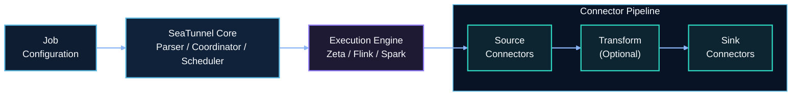
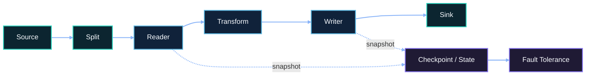

# Architecture

## Overview

SeaTunnel is a distributed data integration platform with a pluggable architecture. It decouples the connector layer from the execution engine, allowing the same connectors to run on different engines.

## Core Components

### 1. Connector API

Engine-independent API for developing Source, Transform, and Sink connectors.

| Component | Description |
|-----------|-------------|
| **Source** | Reads data from external systems (databases, files, message queues) |
| **Transform** | Performs data transformations (field mapping, filtering, type conversion) |
| **Sink** | Writes data to target systems |

### 2. Execution Engines

| Engine | Best For |
|--------|----------|
| **SeaTunnel Engine (Zeta)** | Data synchronization, CDC, low resource usage |
| **Apache Flink** | Complex stream processing, existing Flink infrastructure |
| **Apache Spark** | Large-scale batch processing, existing Spark infrastructure |

### 3. Translation Layer

Translates SeaTunnel's unified API to engine-specific implementations, enabling connector reuse across engines.

## Data Flow

**Key Features:**
- Parallel reading with split-based distribution
- Exactly-once semantics via distributed snapshots
- Automatic failover and recovery

## Module Structure

| Module | Responsibility |
|--------|----------------|
| `seatunnel-api` | Core API definitions |
| `seatunnel-connectors-v2` | Source and Sink connectors |
| `seatunnel-transforms-v2` | Transform plugins |
| `seatunnel-engine` | SeaTunnel Engine (Zeta) |
| `seatunnel-translation` | Engine adapters for Flink and Spark |
| `seatunnel-core` | Job submission and CLI |
| `seatunnel-formats` | Data format handlers |
| `seatunnel-e2e` | End-to-end tests |

## Job Execution Flow

1. **Parse** - Read and validate job configuration
2. **Plan** - Generate execution plan with parallelism
3. **Schedule** - Distribute tasks to workers
4. **Execute** - Run Source → Transform → Sink pipeline
5. **Monitor** - Track progress, metrics, and checkpoints

## Next Steps

- [Engine Comparison](../engines/overview.md)
- [Quick Start](../getting-started/locally/quick-start-seatunnel-engine.md)
- [Connector List](../connectors/overview.md)
